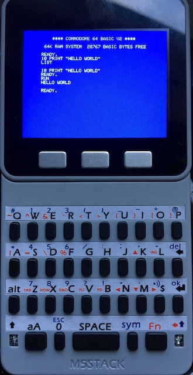

# A simple C64 Emulator(Simulator) for the M5Stack

Text only support
Just really supports basic.

There are 10 'slots' where machines states can be saved.
The current slot number is shown in the bottom right.

Press A to cycle through the slots
(Hold and release A to powerdown)

B to load the save state

C the save the state

